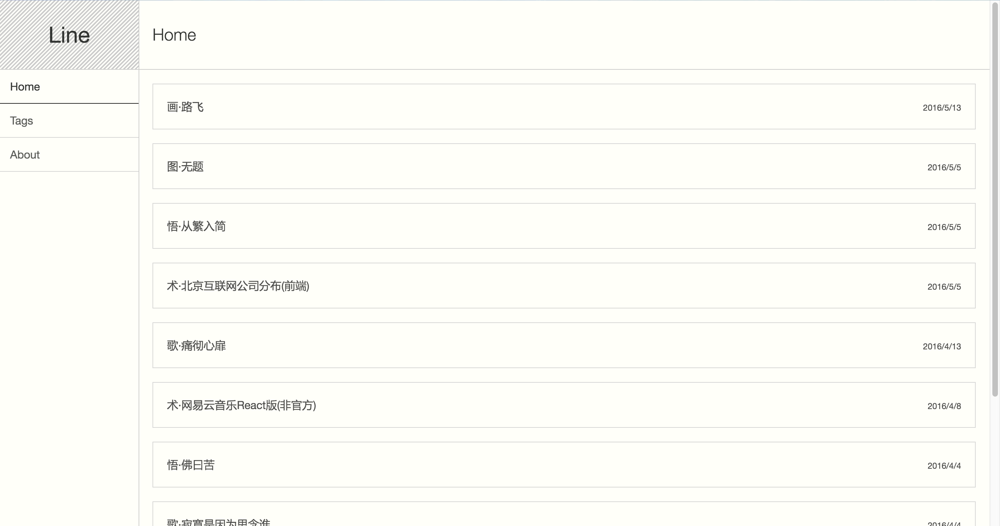
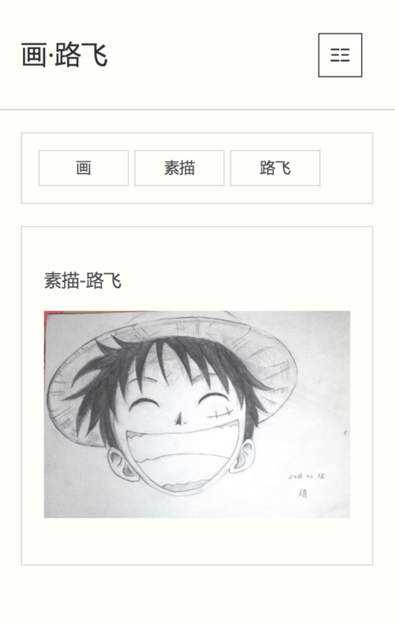
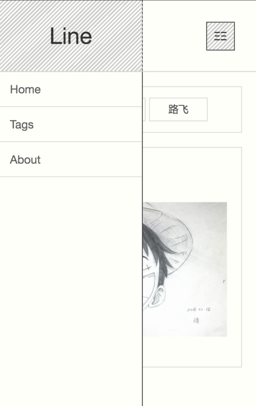
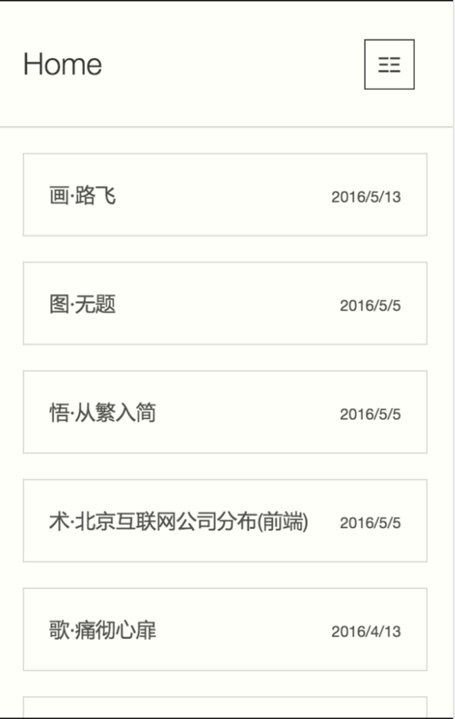

# hexo-theme-line
Dead simple and beautify Hexo theme

# preview
- desktop
    - 
- device
    - 
    - 
    - 

# how to use
- clone this theme
```
git clone themes/line
```
- change _config.yml theme: line
- enjoy

# feedback
so, if you like this theme, issue me.

# enjoy!


